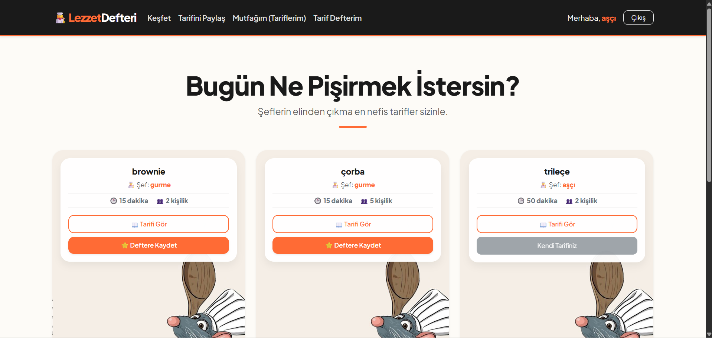
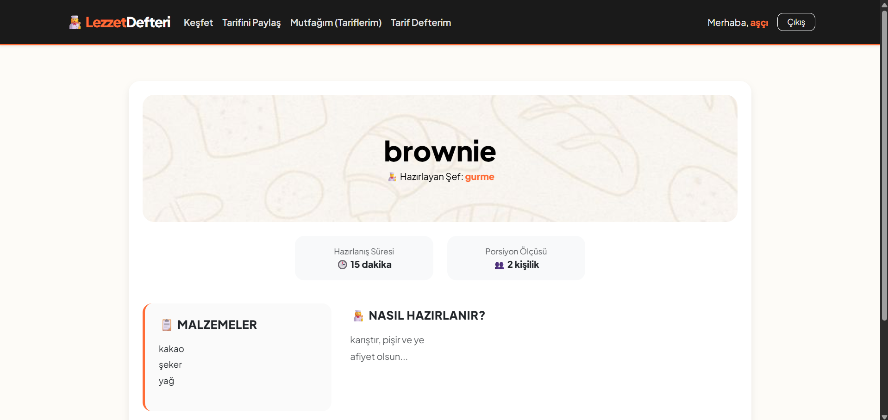

# 👩‍🍳 Lezzet Defteri

PHP ve MySQL ile geliştirilmiş, kullanıcıların yemek tarifi paylaşıp kaydedebileceği bir web uygulaması.

---

## 🎥 Demo Videosu

[Demo Video](https://drive.google.com/file/d/1p1lb_8t7W3ZQpUEhn0f93ipFhIPyQBC8/view?usp=drive_link)

---

## 📸 Ekran Görüntüleri

| Ana Sayfa Vitrini | Tarif Detay Paneli |
| :---: | :---: |
|  |  |
| *Görsel 1: Minimal dijital yemek kartı tasarımı* | *Görsel 2: Premium detay ve aşamalar ekranı* |

---

## 🚀 Özellikler

- Kullanıcı kaydı ve güvenli giriş (`password_hash` / `password_verify`)
- Tarif ekleme, düzenleme ve silme
- Tarifleri "Tarif Defteri"ne kaydetme
- Kendi tariflerini ayrı sayfada yönetme
- Responsive tasarım (Bootstrap 5)

---

## 🛠️ Kurulum

### Gereksinimler
- PHP 7.4+
- MySQL 5.7+
- Apache / XAMPP / WAMP

### Adımlar

1. Repoyu klonla:
```bash
git clone https://github.com/haticesenaasik/Lezzet-Defteri.git
```

2. Proje klasörünü sunucu dizinine taşı:
```
XAMPP → htdocs/lezzet-defteri/
WAMP  → www/lezzet-defteri/
```

3. Veritabanını oluştur, `baglan.php` içindeki bilgileri kendi bilgilerinle güncelle:
```php
$baglanti = mysqli_connect("localhost", "KULLANICI_ADIN", "SIFRE", "VERITABANI_ADI");
```

4. Aşağıdaki SQL'i phpMyAdmin'de çalıştır:
```sql
CREATE TABLE kullanicilar (
    id INT AUTO_INCREMENT PRIMARY KEY,
    kullanici_adi VARCHAR(50) NOT NULL UNIQUE,
    eposta VARCHAR(100) NOT NULL UNIQUE,
    sifre VARCHAR(255) NOT NULL
);

CREATE TABLE tarifler (
    id INT AUTO_INCREMENT PRIMARY KEY,
    user_id INT NOT NULL,
    baslik VARCHAR(150) NOT NULL,
    malzemeler TEXT,
    yapilis TEXT,
    sure VARCHAR(50),
    kisi VARCHAR(50),
    FOREIGN KEY (user_id) REFERENCES kullanicilar(id) ON DELETE CASCADE
);

CREATE TABLE kaydedilenler (
    id INT AUTO_INCREMENT PRIMARY KEY,
    user_id INT NOT NULL,
    tarif_id INT NOT NULL,
    FOREIGN KEY (user_id) REFERENCES kullanicilar(id) ON DELETE CASCADE,
    FOREIGN KEY (tarif_id) REFERENCES tarifler(id) ON DELETE CASCADE
);
```

5. Tarayıcıda aç:
```
http://localhost/lezzet-defteri/
```

---

## 📁 Dosya Yapısı

```
lezzet-defteri/
├── alt.php             # Footer
├── ana_sayfa_ss.png
├── baglan.php          # Veritabanı bağlantısı — kendi bilgilerini gir
├── cikis.php           # Çıkış işlemi
├── giris.php           # Giriş sayfası
├── index.php           # Ana sayfa — tüm tarifler
├── kart_bg.jpg         # Kart arka plan görseli
├── kart_detay_bg.jpg   # Detay sayfası arka plan görseli
├── kaydedilenler.php   # Kaydedilen tarifler
├── kaydet_islem.php    # Tarif kaydetme işlemi
├── kaydet_sil.php      # Kaydedilen tarifi kaldırma
├── kaydol.php          # Kayıt sayfası
├── tarif_detay_ss.png
├── tarifdetay.php      # Tarif detay sayfası
├── tarifduzenle.php    # Tarif düzenleme
├── tarifekle.php       # Yeni tarif ekleme
├── tariflerim.php      # Kullanıcının kendi tarifleri
├── tarifsil.php        # Tarif silme işlemi
└── ust.php             # Header (navbar, session, CSS)
```

---

## 🧰 Kullanılan Teknolojiler

| Teknoloji | Açıklama |
|---|---|
| PHP | Sunucu taraflı dil |
| MySQL | Veritabanı |
| Bootstrap 5 | Responsive tasarım |
| Plus Jakarta Sans | Yazı tipi |

---

## 📄 Lisans

Bu proje [MIT Lisansı](LICENSE) ile lisanslanmıştır.